# Jobsheet 7 — Aplikasi OCR Sederhana (Flutter + ML Kit & Tesseract.js)

Jobsheet ini mendokumentasikan pembuatan **aplikasi OCR (Optical Character Recognition)** dengan Flutter. Aplikasi berjalan di **Android** (menggunakan *Google ML Kit Text Recognition*) dan juga di **Web/Browser** (menggunakan *Tesseract.js* via JS interop).  
Pada implementasi **Web**, disediakan **dua opsi input** agar fleksibel terhadap keterbatasan hardware/izin browser: **Pilih menggunakan Kamera** (kamera live) dan **Pilih dari Folder / Galeri Foto** (file picker).

---

## 🚀 Ringkasan
- **Tujuan**: Membuat aplikasi Flutter multi-halaman untuk **memindai teks dari gambar** menggunakan kamera/galeri dan menampilkan **hasil OCR** di halaman terpisah.
- **Platform**: Android (native, ML Kit), Web (Tesseract.js).
- **Alasan 2 opsi input (Web)**: beberapa perangkat/driver webcam (mis. kamera eksternal) atau kebijakan browser dapat menghalangi proses `takePicture()` dari `camera_web`. Karena itu, disediakan **kamera live** *dan* **file/galeri** sebagai *fallback* agar praktikum tetap dapat diselesaikan.
- **Catatan praktikum**: Koneksi perangkat fisik (USB debugging) sempat terkendala, sehingga pengujian dilakukan di **emulator**/**browser**.

---

## 🎯 Tujuan Praktikum
1. Membuat aplikasi Flutter multi-halaman.  
2. Menggunakan plugin kamera untuk mengambil gambar.  
3. Mengintegrasikan OCR menggunakan **Google ML Kit Text Recognition** (Android) & **Tesseract.js** (Web).  
4. Menampilkan hasil OCR di halaman terpisah.  
5. Menerapkan navigasi dasar antar layar menggunakan `Navigator`.

---

## 🧰 Alat & Bahan
- Laptop/PC dengan **Flutter SDK**.
- **VS Code** atau **Android Studio**.
- **Emulator Android** atau **perangkat Android** fisik (opsional bila USB debugging berfungsi).
- **Browser Chrome** (untuk mode Web) & koneksi internet (mengambil model Tesseract).

---

## 📂 Struktur Proyek (ringkas)
```
ocr_sederhana/
├─ lib/
│  ├─ main.dart
│  ├─ web_ocr.dart               
│  └─ screens/
│     ├─ splash_screen.dart
│     ├─ home_screen.dart
│     ├─ scan_screen.dart        
│     └─ scan_web_camera.dart    
│     └─ result_screen.dart
├─ web/
│  └─ index.html                 
├─ android/app/src/main/AndroidManifest.xml
├─ pubspec.yaml
└─ assets/                       
```

---

## 📦 Dependensi & Konfigurasi
- **pubspec.yaml** (ringkas): `google_mlkit_text_recognition`, `camera`, `image_picker`, `js`, `permission_handler` (opsional Android), `path_provider`, `path`.  

  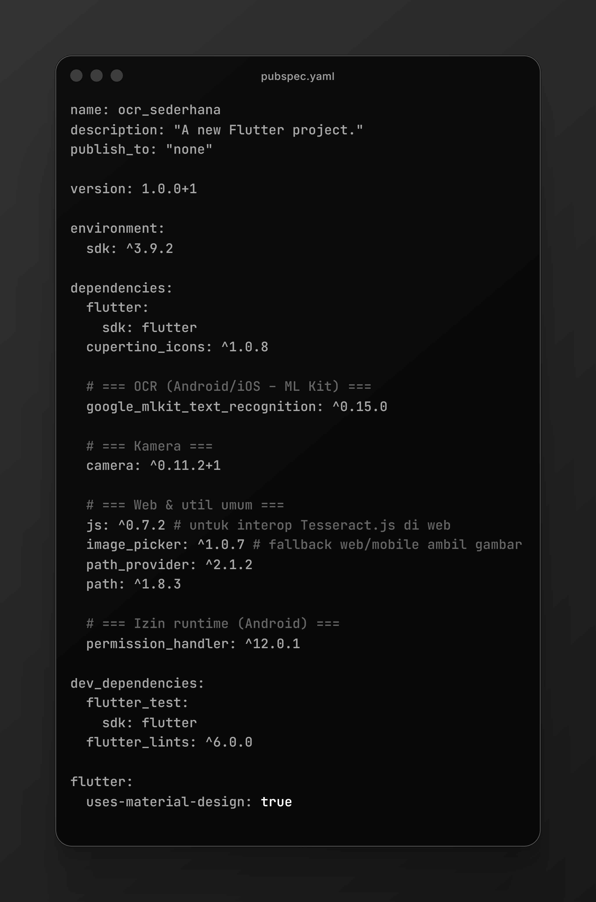

- **AndroidManifest.xml**: pastikan izin kamera berada **di dalam `<manifest>` & sebelum `<application>`**.  
  ```xml
  <uses-permission android:name="android.permission.CAMERA" />
  ```

- **web/index.html**: memuat **Tesseract.js** dari CDN dan mengekspor fungsi `window.tesseractOcr(dataUrl, lang)` agar bisa dipanggil dari Dart.  

  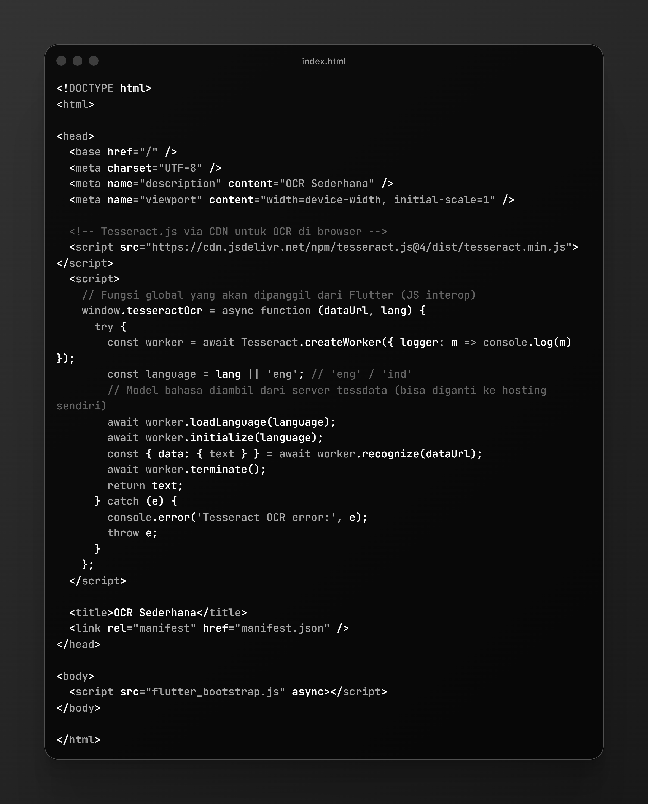

---

## 🧠 Arsitektur Fungsional
- **Android/iOS**: `scan_screen.dart` membuka **CameraPreview**, ambil foto → proses OCR via **ML Kit** → kirim teks ke `ResultScreen`.  
- **Web**:
  - **Pilih menggunakan Kamera** → menuju `scan_web_camera.dart` (kamera live via `camera_web`) → *capture* → OCR via **Tesseract.js**.
  - **Pilih dari Folder / Galeri Foto** → `image_picker` (file dialog/galeri) → konversi ke **DataURL** → OCR via **Tesseract.js**.

---

## 🧩 Potongan Kode (tangkapan layar)
> Berikut cuplikan utama kode program yang direferensikan pada praktik:

- `main.dart`  

  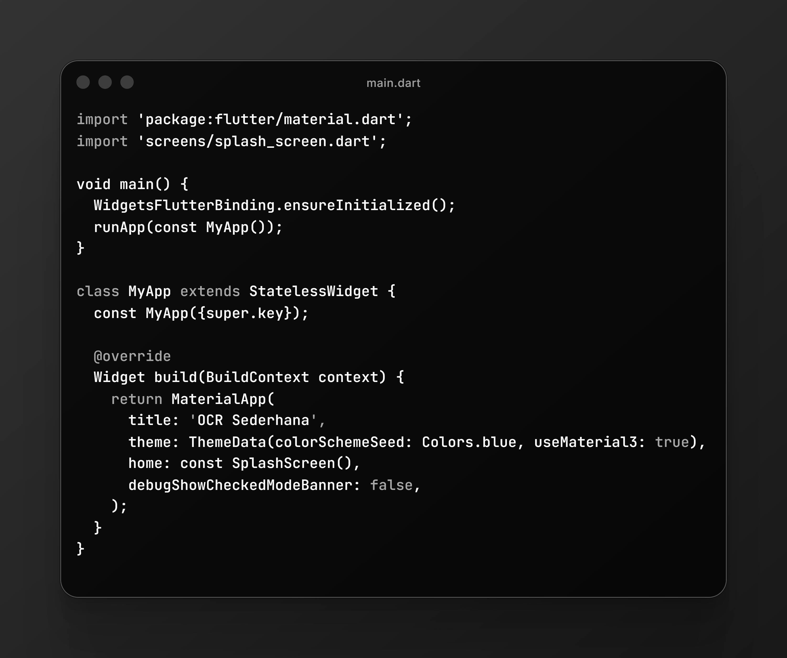

- `splash_screen.dart`  

  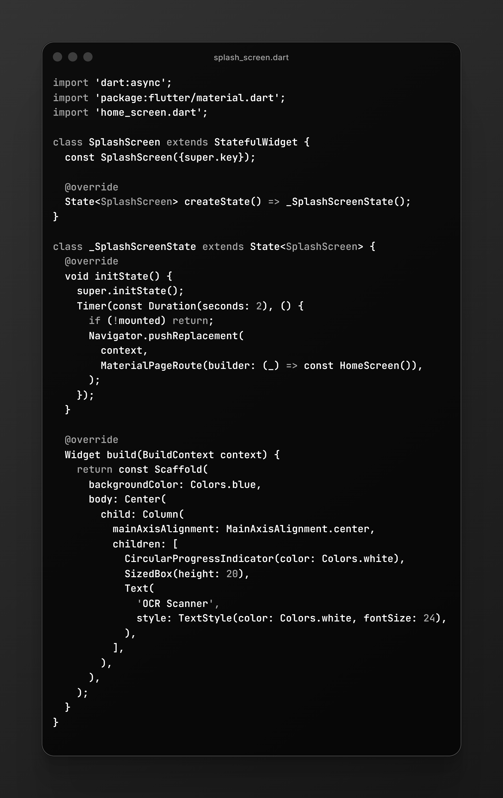

- `home_screen.dart` (tombol seragam dengan style *pill*)  

  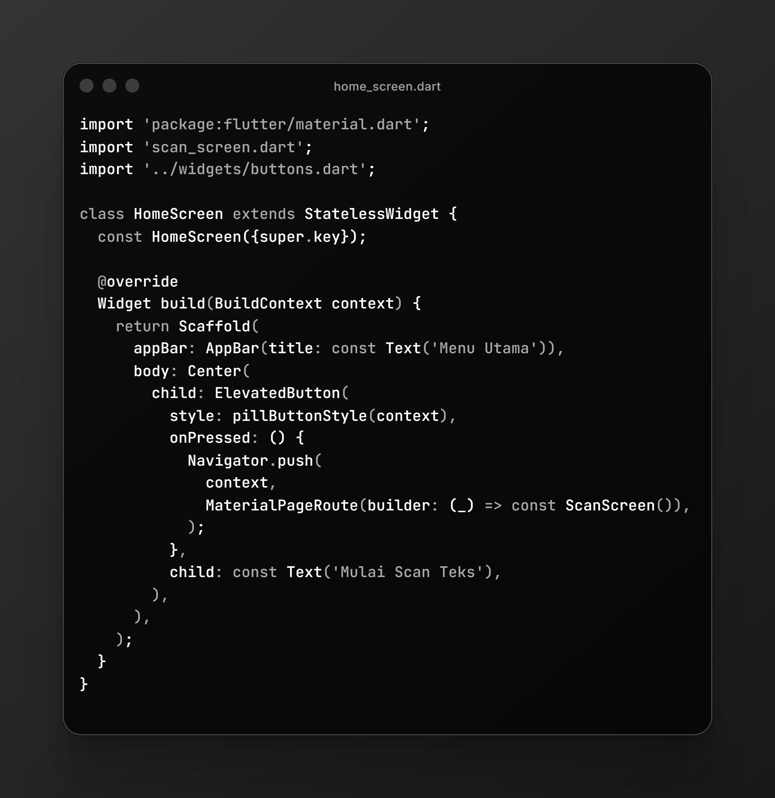

- `buttons.dart` (utility style tombol)  

  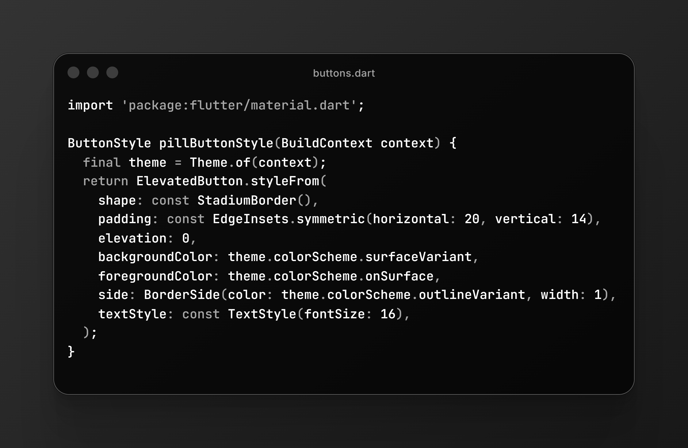

- `web_ocr.dart` (JS interop Tesseract)  

  

- `scan_screen.dart` (dua opsi: kamera & galeri)  

  

- `scan_web_camera.dart` (kamera live di Web + dropdown pilih kamera)  

  

- `result_screen.dart`  

  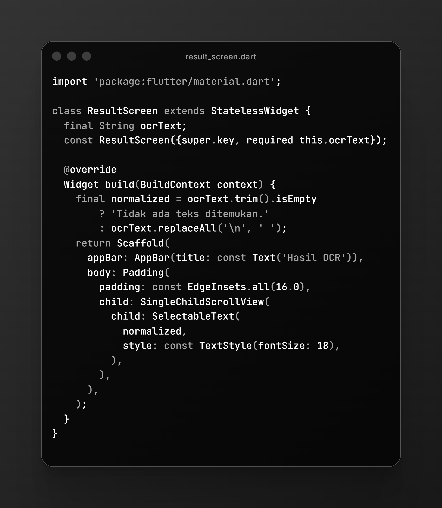

---

## 🖼️ Hasil Tampilan
- **Splash Screen**  

  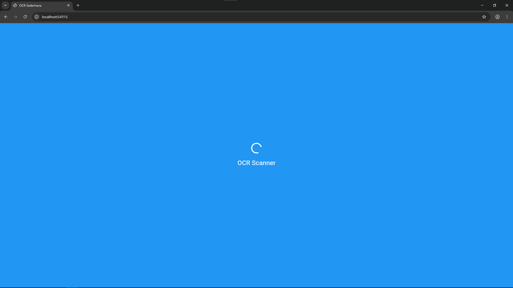

- **Menu Utama**  

  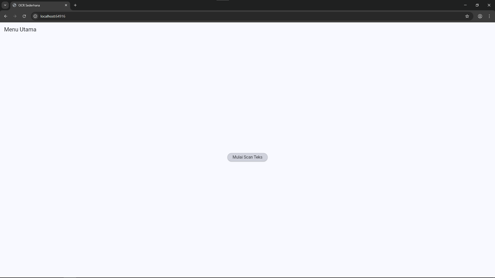

- **Scan (Web) – Opsi**  

  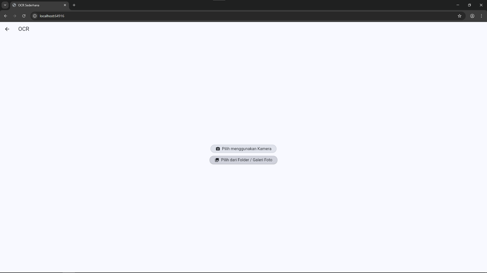

  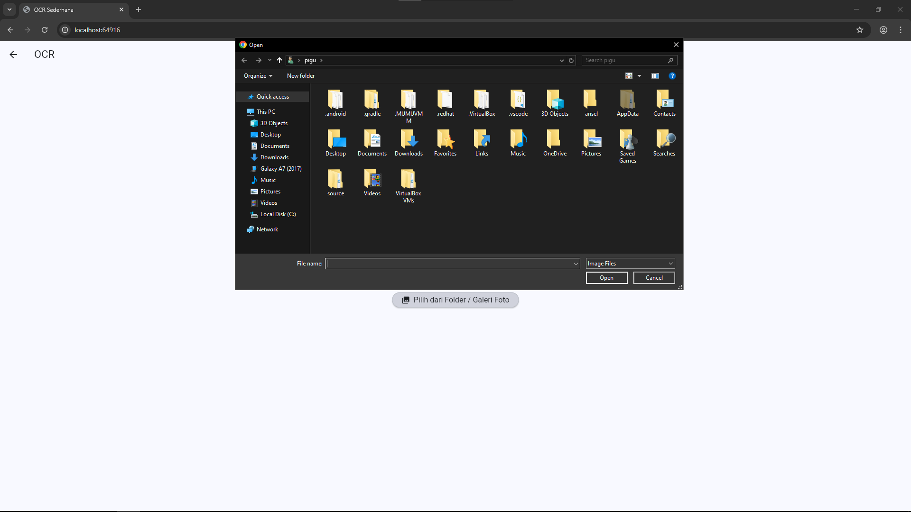

- **Hasil OCR**  

  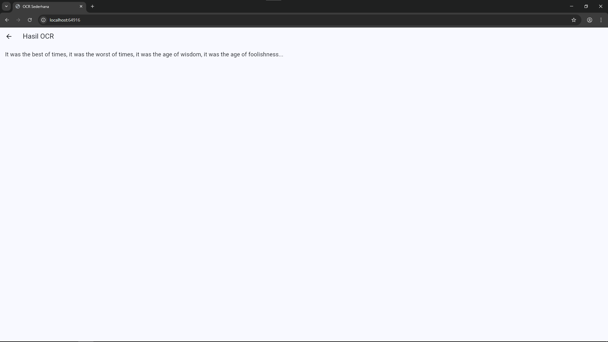

*(Tambah screenshot lain sesuai kebutuhan, mis. `tes.png` sebagai bahan uji OCR:)*  


---

## ▶️ Cara Menjalankan
### Android (disarankan untuk akurasi)
```bash
flutter clean
flutter pub get
flutter run -d <device_id>     # atau langsung 'flutter run' bila hanya 1 device
# Build APK jika perlu:
flutter build apk --debug
```
> Jika perangkat fisik **tidak terdeteksi**, gunakan **emulator**. Pastikan `USB debugging` aktif & driver ADB terpasang.  
> Di beberapa laptop/HP, koneksi USB bisa bermasalah → **emulator** adalah alternatif aman untuk praktikum ini.

### Web (Chrome)
```bash
flutter run -d chrome
```
- Pastikan membuka dari **http://localhost** atau **HTTPS**, dan **izinkan kamera** pada ikon gembok Chrome.  
- Jika `takePicture()` gagal (beberapa webcam eksternal), gunakan opsi **Pilih dari Folder / Galeri Foto** sebagai *fallback*.

---

## 🧪 Tugas Praktikum — Jawaban
**1) Jalankan aplikasi di emulator/HP & scan teks cetak → amati hasil OCR.**  
Hasil uji pada gambar `assets/tes.png` menampilkan teks terbaca dengan tingkat akurasi yang baik pada huruf jelas/kontras, tetapi ada beberapa karakter yang keliru pada bagian yang kecil atau miring.

**4a) Apakah semua teks terbaca dengan akurat? Mengapa?**  
Tidak selalu. Akurasi dipengaruhi oleh:
- **Pencahayaan & kontras**: gelap/silau menurunkan rasio kontras sehingga model kesulitan memisahkan huruf dari latar.  
- **Ketajaman fokus & resolusi**: blur/gerak tangan menyebabkan tepi huruf kabur.  
- **Sudut & distorsi**: foto miring/permukaan melengkung (buku tebal) memicu *warping* dan jarak antar-glyph tidak konsisten.  
- **Tipe font & ukuran**: font dekoratif, huruf terlalu kecil (<10–12 pt), atau *kerning* ekstrem menurunkan *confidence*.  
- **Bahasa/model**: jika konten Indonesia tetapi model yang dipakai `eng`, beberapa kata akan salah.  
- **Noise/artefak**: kompresi JPEG berlebih atau bayangan tepi huruf.

**4b) Apa kegunaan OCR dalam kehidupan sehari-hari? (contoh use-case)**  
- Digitalisasi dokumen (buku, nota, resep) agar bisa dicari/diindeks.  
- *Data entry* otomatis (form KTP/NPWP, alamat paket, kode voucher).  
- Penerjemahan teks di kamera (*live translate*).  
- Pembacaan meteran (listrik/air), label obat, label barang.  
- Membuat teks dapat di-*copy-paste* dari foto/screenshot.

**4c) Sebutkan 2 contoh aplikasi nyata yang menggunakan OCR!**  
- **Google Lens / Google Keep / Google Drive (Scan)** — ekstraksi teks dari foto/screenshot.  
- **Microsoft Office Lens / Adobe Scan** — pemindaian dokumen menjadi PDF dengan teks yang dapat dicari.

---

## ❓ Kenapa ada 2 opsi (Kamera & Galeri) di Web?
- **Kamera (live)** memberi pengalaman seperti di Android, tetapi pada beberapa kombinasi **browser + driver kamera eksternal** (mis. webcam USB) fungsi *capture* bisa gagal.  
- **Galeri/Folder** adalah **fallback** yang stabil: browser membuka UI kamera/galeri sistem, menghasilkan foto **JPEG** yang kemudian diproses **Tesseract.js**.  
- Saat **USB debugging** ke perangkat fisik bermasalah, praktikum tetap bisa dituntaskan via **emulator**/**browser** dengan opsi ini.

---

## 🛠️ Troubleshooting Singkat
- **Perangkat Android tidak terdeteksi**: cek `USB debugging`, coba `adb devices`, instal driver perangkat, atau gunakan emulator.  
- **Web “camera not readable”**: tutup aplikasi lain yang pakai webcam (Zoom/Meet), jalankan dari `http://localhost`, izinkan **Camera**, turunkan resolusi (sudah di-set `ResolutionPreset.low`), gunakan **Galeri** sebagai *fallback*.  
- **Izin kamera Android**: pastikan `<uses-permission android:name="android.permission.CAMERA" />` ada & `permission_handler` meminta izin saat runtime.  
- **Akurasi rendah**: perbaiki pencahayaan, jaga jarak kamera, luruskan kertas, gunakan model bahasa yang sesuai (`lang: 'ind'` untuk Bahasa Indonesia).

---

## 👤 Author
- **Nama**: A. A. Ngurah Sadhu Gunawan
- **NIM**: 2341760168
